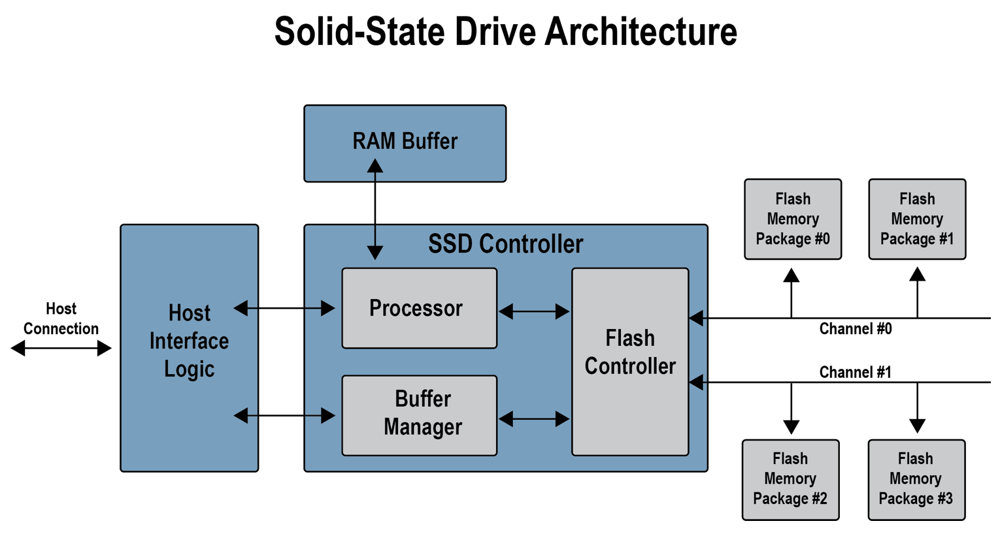

FTL(Flash Translation Layer)
========
SSD(Solid State Drive) vs. HDD(Hard Disk Drive)
-----
SSD는 HDD를 대체하는 새로운 기억장치로, 2020년 현재에는 대부분의 기억장치로써 SSD를 사용하고 있다. HDD보다 용량 대비 가격이 비싸지만, SSD를 사용하게 된 가장 큰 이유는 바로 read/write의 속도에 있다. 통상적으로 HDD의 sequential read/write의 속도는 200mb/s정도이나, NVMe interface를 사용하는 SSD의 경우에는 12GB/s에 달하는 속도가 나오기도 한다. 이처럼 SSD는 HDD에 비해 굉장히 빠른 read/write의 속도를 가지기 때문에 대부분 HDD대신 SSD를 사용한다.

이렇게 HDD에 비해서 SSD의 속도가 빠른 이유는 바로 데이터를 저장하는 방식에 있다. 먼저, HDD의 경우에 아래의 그림과 같이 cylinder와 arm으로 이루어져 있어서 cylinder가 회전을 하면 arm이 platter의 데이터를 read하는 방식이다. 이처럼 물리적으로 데이터를 저장하는 방식이기 때문에 만약 데이터가 sequential하게 read/write할 경우에는 그나마 빠른 속도로 read/write를 할 수 있지만, random read/write처럼 물리적으로 떨어져있을 경우에는 그만큼 arm과 cylinder가 이동해야하는 양이 많이지기 때문에 read/write 성능이 대폭 떨어지게 된다.

SSD의 구조는 다음과 같다. SSD는 논리적으로 데이터를 저장하는 저장장치로, 크게 컨트롤러와 플래시 메모리 두부분으로 구성된다. 플래시 메모리는 전원이 끊겨도 데이터를 보존하는 특성을 가진 반도체로, 일반적으로 전원이 꺼지면 기억된 정보를 모두 잃어버리는 반도체인 DRAM, SRAM과 달리 비휘발성 메모리이다. 플래시 메모리는 전기적인 방법으로 데이터를 저장한다. SSD는 HDD와는 다른 특징들이 몇가지 있다. 먼저, SSD의 경우에는 최대 쓰기제한 횟수가 존재한다. 두 번째, overwrite가 되지 않는다. 세 번째, page단위로 write하고, block단위로 erase 한다.

FTL(Flash Translation layer)
-----
FTL은 SSD의 내부에서 작동하는 프로그램으로 SSD의 핵심 펌웨어이다. 앞서 설명 했던 것처럼, SSD는 HDD와는 다른 특징들이 존재한다. 이러한 특징들로 인해서, SSD는 FTL이라는 펌웨어를 이용하여 SSD를 조정한다. FTL이 하는 일은 크게 4가지정도가 있다.

1. 메모리 매핑
2. Wear Leveling
3. Garbage Collection
4. Over Provisioning

먼저, SSD의 플래시 메모리 구조는 여러 개의 flash memory와 통신하는 channel, 하나의 플래시 메모리는 Die로 나누어지고, Die는 plane으로 plane은 block으로 block은 page로 나누어진다. 따라서, 데이터를 저장할 경우에 OS level에서 사용하는 주소방식으로는 SSD에 데이터를 저장할 수가 없다. 따라서, FTL에는 LBA2PPA매핑 테이블이 있어서, OS level에서 사용한 메모리 주소를 SSD에서 사용할 수 있는 주소로 바꿔주는 역할을 한다.

두 번쨰, SSD는 썼다 지웠다 할때마다 각각의 비트를 저장하는 단위인 셀에 extra charge가 되기 때문에 셀의 수명에 한계가 있다. 따라서 SSD의 한 영역만 계속 사용할 경우에 추후에 특정영역만 사용이 불가해지는 상황이 생길 수 있다. FTL은 이러한 상황을 최소화 하기 위해서 block당 write하는 횟수를 모니터링 하여 균등하게 분배될 수 있도록 한다.

세 번째, SSD는 Overwrite가 되지 않고, block단위로 erase가 이루어진다. 따라서, 만약 overwrite를 해야하는 상황이 생긴다면, 해당 block의 데이터중 사용되고 있는 vaild data를 새로운 block에 복사하고, 수정할 page의 내용을 수정한뒤 새로운 block에 넣는 방식을 사용한다. 이 경우에 새로운 block에 write를 하기 때문에 기존의 block은 erase를 해야 재사용이 가능한데, SSD에서는 erase를 바로 진행하지 않고 Garbage Collection이라는 프로세스를 통해서 일괄 삭제하게 한다.

네 번째, 앞서 이야기한 Wear Leveling과 Garbage Collection을 진행하기 위해서는 SSD에 저장 공간이 필요한데, 이 저장 공간을 따로 잡아 놓는 것을 Over Provisioning이라고 한다.

FTL은 이러한 기능들을 수행하기 위해서 별도의 메모리를 SSD내부에 가지고 있다. 메모리 공간에는 LBA2PPA mapping table이나 I/O과정에서 다양한 용도로 사용된다.
