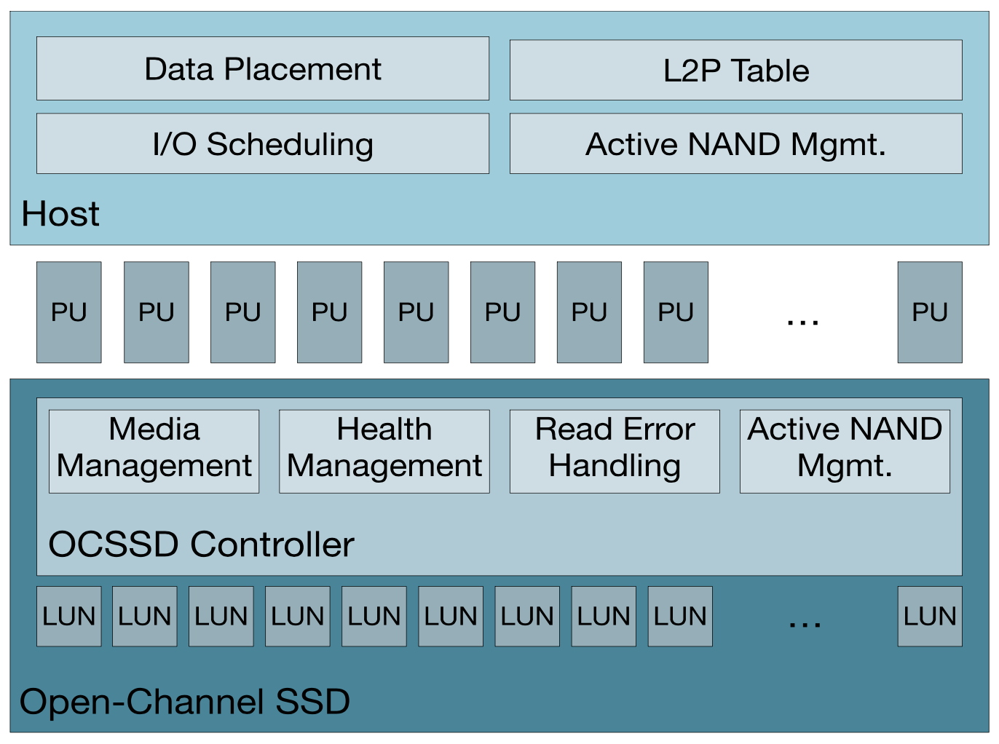
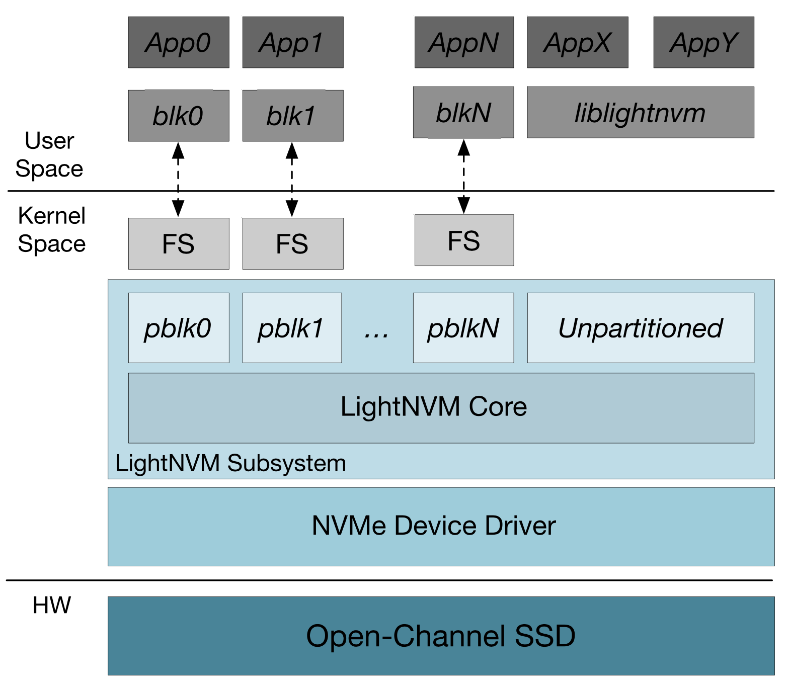

OCSSD
======
OCSSD란?
-----

일반적인 SSD의 경우에는 SSD내부의 연상장치와 RAM 메모리를 이용해서 FTL이 구동되기 때문에 SSD내부의 자세한 정보들을 OS level에서는 알수가 없다. 하지만, OCSSD는 FTL의 일부정보들을 Host의 RAM메모리에 load하기 때문에 host OS level에서도 SSD의 내부정보를 쉽게 가져올 수 있는 SSD이다.

위 그림은 OCSSD2.0버전의 구조를 이미지로 나타낸 것이다. L2P Table을 Host RAM에서 관리함으로써, 메모리 매핑과 그와 관련된 것들을 Host에서 진행하기 때문에, 본 연구에서 필요한 L2P Table을 보다 손쉽게 얻을 수 있을 것으로 기대된다.

OCSSD Lightnvm Architecture
-------

Lightnvm은 사용자가 OCSSD에 접근하기위해서 사용하는 인터페이스이다. OCSSD와 사용자간의 정보교환은 위 그림과 같이 이루어진다. 가장 아래에 하드웨어로 OCSSD가 존재하고, 이와 직접적으로 통신되는 것이 NVMe Device Driver이다. 그 위에 LightNVM Subsystem이 device driver와 통신하고, LightNVM은 pblk와 통신, pblk가 사용자 레벨인 Application level과 통신함으로써 Application에서 OCSSD의 다양한 정보들을 사용할 수 있게 되는 것이다. 
