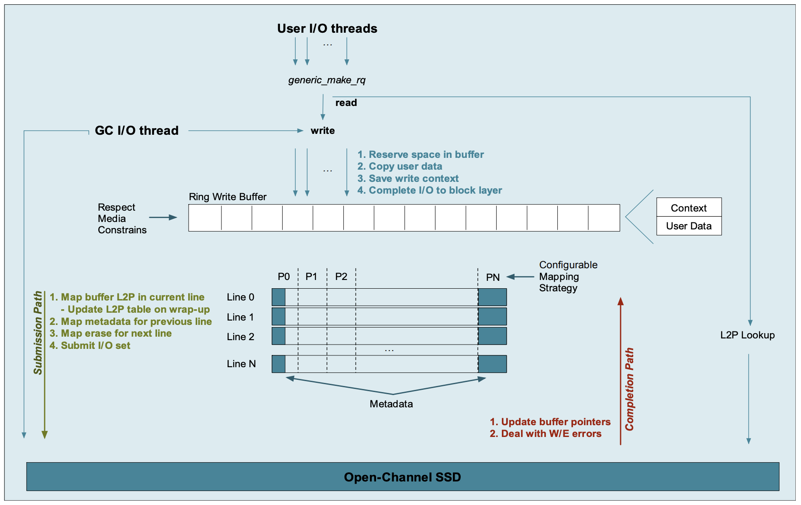

pblk I/O
=========
file의 OS level에서의 논리적 주소인 LBA의 경우에는 OS가 관리하는 주소이기 때문에 얻는 것이 크게 어렵지 않다. 하지만, 실제 SSD에 저장되는 주소인 PPA는 SSD의 FTL이 관리하기 때문에 FTL의 구조를 파악하고 있어야만 LBA2PPA table을 쉽게 가져올 수 있을 것이다. 

## READ
Read의 경우 write에 비해서 간단한 메커니즘으로 수행한다. 먼저, User가 Read 명령을 내리면, generic_make_rq를 통해서 L2P table을 통해 read로 요청된 Logical address를 Physical Address로 변경하여 Open-Channel SSD에 read를 요청한다.

## WRITE
Write명령이 User로 부터 요청되면, Ring Write Buffer에 차례대로 Write하게 된다. Ring Write Buffer를 사용하는 이유는 SSD의 특성 때문이다. SSD는 page단위의 read/write를 하게 되는데 그렇기 때문에 page만큼의 write양이 쌓고, page단위로 write 하기 위해서 사용한다. 만약 Ring Write Buffer가 공간이 부족할 경우에는 Ring write Buffer의 데이터가 OCSSD에 Write되어 내려 갈때까지 기다린다.

Ring Write Buffer에서 OCSSD로 Write를 할 때는 우선, 요청된 lba와 실제로 write할 ppa의 매핑정보를 l2p table에 기록을 하고, OCSSD metadata에 OCSSD의 공간 사용정보를 기록한 후에 write 하게 된다.

### Ring Write Buffer
